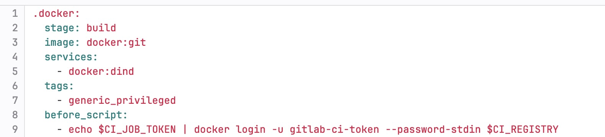
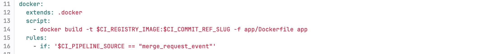
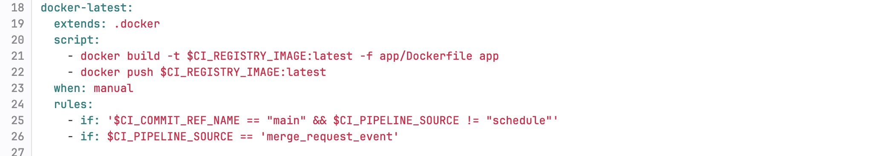
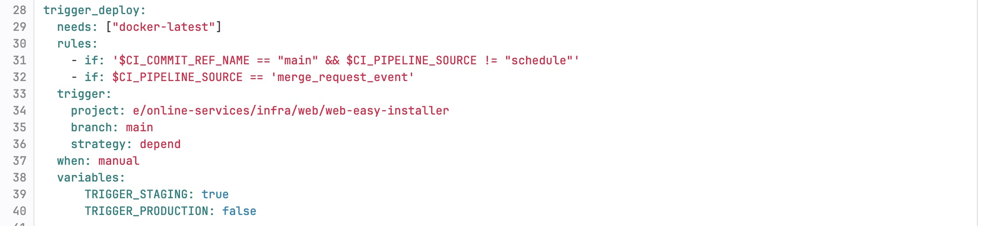
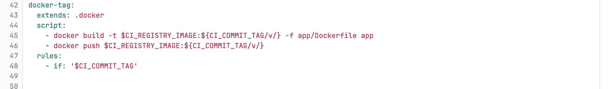
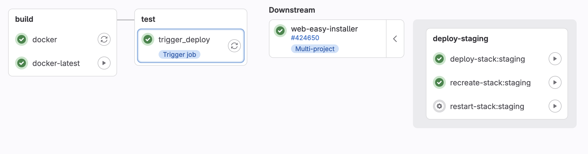

[last updated : 2024-08-12 ]

`app` folder contains the source of the application.

`extern` folder contains dependencies that are *not* embedded from package.json
    This is the case for fastboot.js the `fastboot.js/dist` folder if modified must be copied into `app\src\static\js\fastboot` folder


# Build the image

Go to the `app` folder.

`docker build -t eos-web-installer .`

# Run the project

## Windows
`docker run -v "%cd%"\src:/app/src -p 127.0.0.1:3000:3000 eos-web-installer`

## Linux
`docker run -v "${pwd}"\src:/app/src -p 127.0.0.1:3000:3000 eos-web-installer`

The project is available at `http://localhost:3000/`

# Deployment

## Deploy using Docker Compose Stack

The eos-web-installer can be deployed using the Docker Compose stack provided in the <https://gitlab.e.foundation/e/online-services/infra/web/web-easy-installer> repo.
To deploy the application:

1. Clone repository:

   ```
   git clone https://gitlab.e.foundation/e/online-services/infra/web/web-easy-installer.git
   cd /mnt/repo-base/web-easy-installer
   ```

2. Copy example.env file to .env:

   ```
   cp example.env .env
   ```
3. Deploy the application:

   ```
   docker compose up -d
   ```
   This command will pull the latest image from the Docker registry and start the eos-web-installer service.

4. Access the application
Once deployed, the eos-web-installer will be accessible at `http://localhost:3000` 

## CI/CD Pipeline Overview

The `eos-web-installer` project is equipped with a CI/CD pipeline that automates the process of building, tagging, and deploying Docker images. Below is an overview of each stage in the pipeline:

### 1. `.docker` Stage



   - **Purpose**: This stage serves as the base configuration for all Docker-related jobs in the pipeline. It sets up the necessary Docker environment, including Docker-in-Docker (dind) service, and logs into the Docker registry.
   - **Key Actions**:
     - Sets up the Docker environment.
     - Logs into the Docker registry.

### 2. `docker` Stage



   - **Purpose**: This stage builds a Docker image tagged with the current commit reference slug (usually a short version of the commit hash or branch name). It is triggered during a merge request event.
   - **Key Actions**:
     - Builds the Docker image using the `app/Dockerfile`.
     - Tags the image with the commit reference slug (`$CI_COMMIT_REF_SLUG`).

### 3. `docker-latest` Stage



   - **Purpose**: This stage builds and pushes a Docker image tagged as `latest`. This image is intended for the staging or production environments.
   - **Key Actions**:
     - Builds the Docker image using the `app/Dockerfile`.
     - Tags the image as `latest`.
     - Pushes the `latest` image to the Docker registry.
   - **Trigger**: This stage is manually triggered when a commit is pushed to the `main` branch or during a merge request event.

### 4. `trigger_deploy` Stage



   - **Purpose**: This stage triggers the deployment of the `latest` Docker image to the staging environment.
   - **Key Actions**:
     - Triggers a deployment in another project (`e/online-services/infra/web/web-easy-installer`).
     - Passes variables to indicate that this is a staging deployment.
   - **Dependencies**: This stage depends on the successful completion of the `docker-latest` stage.

### 5. `docker-tag` Stage



   - **Purpose**: This stage builds and pushes a Docker image tagged with the version number from a Git tag (e.g., `v1.0.0`).
   - **Key Actions**:
     - Builds the Docker image using the `app/Dockerfile`.
     - Tags the image with the Git tag version, removing the `v` prefix (`${CI_COMMIT_TAG/v/}`).
     - Pushes the tagged image to the Docker registry.
   - **Trigger**: This stage is triggered by the creation of a Git tag (`$CI_COMMIT_TAG`).

## Auto-deployment to Staging 

The eos-web-installer supports automated deployment to a staging environment whenever a new image is created. 
This is handled through a CI/CD pipeline defined in the .gitlab-ci.yml file.



### How Auto-Deployment Works

- Pipeline Triggers:
    - Whenever a merge request is approved and merged into the main branch, or a manual trigger is activated, a new Docker image is built and tagged as latest.
    - The pipeline then triggers a deployment process that pushes this image to the Docker registry.
- Staging Deployment:
    - Upon successful creation of the latest image, the pipeline automatically triggers a deployment to the staging environment.
    - The staging environment is defined in the <https://gitlab.e.foundation/e/online-services/infra/web/web-easy-installer> repo. The deployment is managed by the trigger_deploy job in the pipeline.

This setup ensures that every time a new image is created from the main branch, it is automatically deployed to the staging environment for testing and validation.

# Installation

Drop the files used to flash the device in the corresponding folder in  `static/assets/sources`
And **overwrite the .json** file in `static/js/resources` of your device with the correct file name

# Development information


## Model

We link device and its resources with deviceName.toLowerCase().replace(/ /g, ''); ex: One Plus Nord -> oneplusnord.json
Since the deviceName may not be the same in fastboot (Android), we need at least a first connexion in adb to retrieve the deviceName.

## Doctrine

- my-class are for css class
- camelCase are for variable
- $variableName are for DOM Nodes
- MAJUSCULE are for global constant
- object.manager.js are for class directing subClass or vue. It's just my arbitrary concept to mark a class as "directive" in the process
- object.class.js are for class used by object.manager.js where functions should have a single responsibility

Please respect ♥ 


## Defining a process

A process is in  2 parts : steps and folder

### Steps

#### Description

Steps is an array on objects describing the process

```
"steps": [
    {
      "mode": string?,
      "command" : string?,
      "instruction": string?,
      "needUser": boolean?
    }
  ]
```
#### Options

| key           | exemple                         | description                                                                 |
|---------------|---------------------------------|-----------------------------------------------------------------------------|
| `mode`        | `[fastboot\| adb\| bootloader]` | It's a shortcut for a reboot and a reconnect before the command is executed |
| `needUser`    | `[true\| false]`                | The user needs to click on continue before the command is executed          |
| `instruction` | `Please select unlock`          | String displayed to the user at this step. Command is used if not defined   |
| `command`     | `flashing unlock unlocked`      | Command as defined in the next chapter                                      |

#### Available commands

| command                                | exemple                    | description     |
|----------------------------------------|----------------------------|-----------------|
| `[flashing\| oem] unlock [varName?]`   | `flashing unlock unlocked` | --------------  |
| `[flashing\|oem] lock [varName?]`      | `flashing lock`            | --------------  |
| `flash [partitionName] [fileName.img]` | `flashing unlock unlocked` | --------------  |
| `sideload [fileName.zip]`              | `sideload romFile.zip`     | --------------  |
| `erase [partitionName]`                | `erase userdata`           | --------------  |
| `reboot [fastboot\| adb\| bootloader]` | `reboot bootloader`        | --------------  |
| `connect [adb\| bootloader]`           | `connect device`           | --------------  |


For oem, recovery, rom and key, we parse these command and execute them. The others commands are not analyzed and executed arbitrarily in the device.


#### Exemples


### Folder

#### Description

You need to add a variable folder to define the files needed in the installation.
Folder is an array of file :
```
{ 
    name : fileName used for the command ,
    path: path used to download the file,
    unzip: optional boolean in case we have a zip we want to parse
}
```
In case of unzip : the file is unzipped, and the retrieved files are stored in the "folder" like the other file


#### Exemples
```  
{
    "folder": [
      {
        "name": "recovery.img"
        "path" : "assets/sources/coral/recovery-e-1.14-s-20230818321663-dev-coral.img"
      },
      {
        "name": "rom.zip",
        "path" : "assets/sources/coral/e-1.14-s-20230818321663-dev-coral.zip"
      },
      {
        "name": "pkmd_pixel.bin",
        "path" : "assets/sources/coral/pkmd_pixel.bin"
      },
      {
        "path" : "assets/sources/emerald/IMG-e-1.14.2-s-20230825321006-stable-emerald.zip", 
        "name": "Teracube_2e installer",
        "unzip": true 
      },
    ]
 }
  ```


## Vue

### vue.manager.js
Need log.manager.js and translation.manager.js
Need a div with id "process"

### log.manager.js
Need a div with id "log-ctn" to scroll on log added
Need a select with id "log" to add log

### translation.manager.js
Need a select with id "translation" to listen to.
On select change : download the translation file and render the DOM

Translation are in `static/assets/languages`

## Controller

### controller.manager.js


CAUTION

