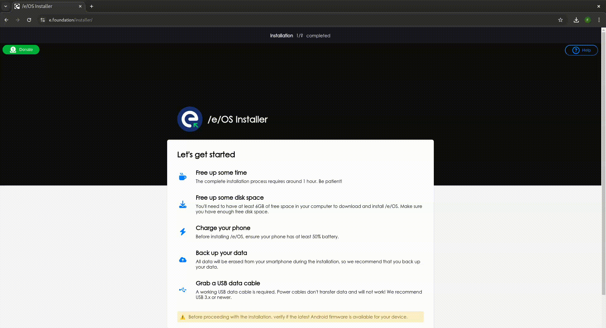

# /e/OS Installer


[](https://e.foundation/installer)
[](https://gitlab.e.foundation/e/devices/eos-installer/-/tree/main/app/public/resources)
[](LICENSE)
[](https://doc.e.foundation/eos-installer) 
[](CONTRIBUTING.md)

Install /e/OS on a device from a chromium-based browser.



## Features

- Detect the device
- Guide the user to unlock the bootloader
- Guide the user to flash /e/OS
- When possible, guide the user to lock the bootloader

## Run the project

1. Get the docker image
   ```
   docker pull registry.gitlab.e.foundation/e/devices/eos-installer:latest
   ```
2. Run a docker container
    ```
    docker run -p 3000:80 eos-installer
    ```
3. The app is available at http://localhost:3000

## Acknowledgments

Using:
- vanilla Javascript, CSS and HTML
- vite as builder
- docker for packaging

Libraries:
- fastboot.js (License: MIT): https://github.com/kdrag0n/fastboot.js/ 
- ya-webadb (License: MIT): https://github.com/yume-chan/ya-webadb
- and more see [package.json](https://gitlab.e.foundation/e/devices/eos-installer/-/blob/main/app/package.json)
